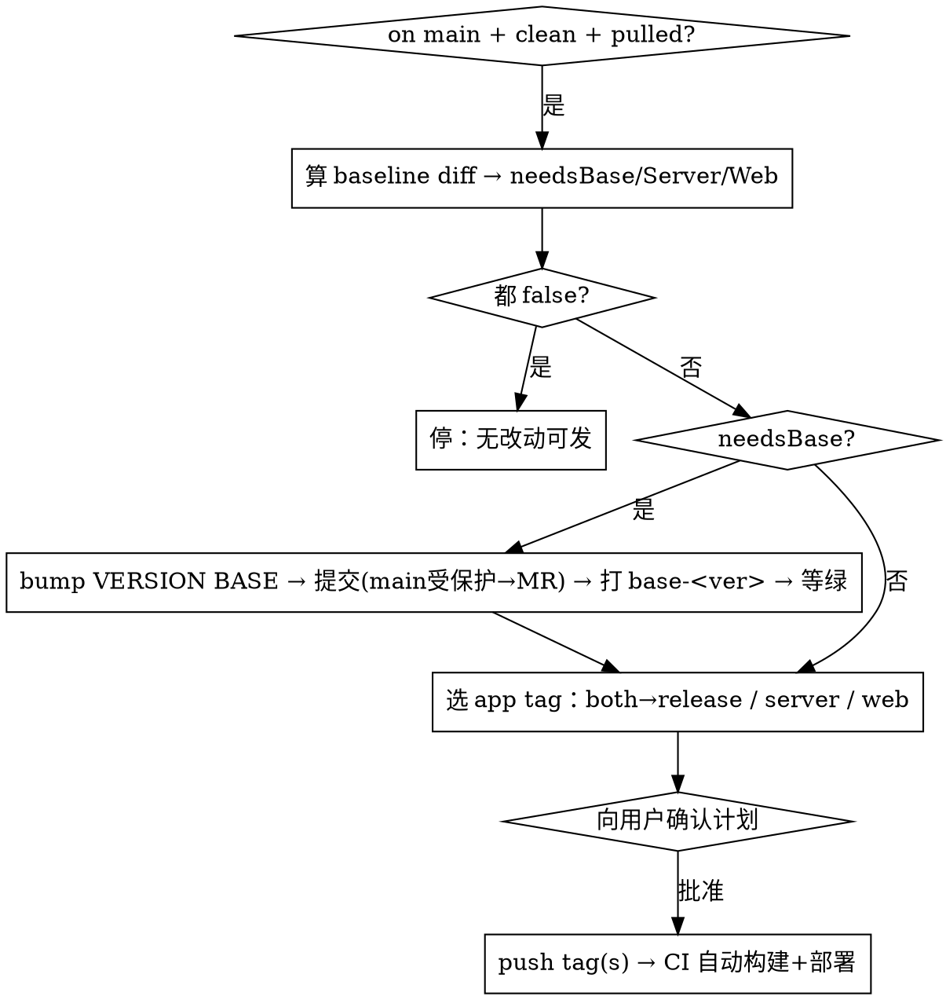

# GEO Collab 发版（tag 驱动自动部署）

## Overview

在 **main** 上打 tag → GitLab CI 自动 kaniko 构建 → 推内网 Harbor → skopeo 隧道搬到服务器 → `deploy.sh` 上线。本 skill 帮你**自动评估该发哪端**并打出正确的 tag。设计与依据见 `docs/superpowers/specs/2026-07-08-tag-driven-deploy-design.md`。

**核心事实**：`server-*`/`web-*`/`release-*` 的镜像版本号来自 **tag 本身**；`deploy/VERSION` 里只有 **`BASE=`** 是构建必需的（`build:server` 的 `FROM …/geo-collab-base:<BASE>`）。所以**只有改了 base 才需要提交、否则直接打 tag 零提交**。

## tag → 端映射

| tag | 构建/部署 | 何时用 |
|---|---|---|
| `base-<ver>` | 只重建 `geo-collab-base` 镜像（不部署） | 依赖/浏览器栈变了 |
| `server-<ver>` | app + worker（跑 alembic 迁移） | 只改了后端 |
| `web-<ver>` | nginx 前端（不迁移） | 只改了前端 |
| `release-<ver>` | server + web 都发 | 前后端都改了 |

## 自动评估规则（改了哪些文件 → 发哪端）

先算基线 diff：`baseline` = main 上最近一个 `base-*/server-*/web-*/release-*` tag。
`git diff <baseline>..HEAD --name-only`，按下表归类：

| 改动路径（前缀匹配） | 触发 |
|---|---|
| `requirements.txt`、`requirements-*.txt`、`Dockerfile.base` | **needsBase**（连带 needsServer，因 server `FROM` base） |
| `server/`、`Dockerfile`（根）、`alembic.ini` | **needsServer** |
| `web/`、`Dockerfile.nginx`、`nginx.conf` | **needsWeb** |

- `needsServer = server/Dockerfile/迁移变了 OR needsBase`
- 三者都为 false → **无需发版**，停下告诉用户「自上次发版以来没有可部署的改动」。

## 决策流程



## 步骤（照做）

1. **前置**：`git checkout main && git fetch <remote> && git pull`。工作区必须干净（`git status` clean）。GEO 的部署远端是 `hlgit`（`git remote -v` 确认；团队成员按各自的 remote 名）。
2. **算基线 + diff**：
   ```bash
   BASE_TAG=$(git tag --merged main --list 'base-*' 'server-*' 'web-*' 'release-*' --sort=-creatordate | head -1)
   git diff "$BASE_TAG"..HEAD --name-only
   ```
   按上表归类得 needsBase / needsServer / needsWeb。
3. **定版本号 —— 注意这是两次独立查询，别用同一个 tag**：
   - **appVer** = `server-*/web-*/release-*` 里最大版本 patch+1（server/web/release 共用这一个；**排除 base-***）。
   - **baseVer** = `base-*` 里最大版本 patch+1（仅 needsBase 时）。
   - ⚠️ 第 2 步的 diff 基线是四类 tag 合并取最新，可能是个 `base-*`；但 appVer **只**从 app 类（server/web/release）取。若最近一次只发过 `base-*`、app 端没跟着发，两个"最新 tag"会不同——diff 基线用那个 base tag，appVer 仍往前找上一个 app 类 tag。
   - 版本形如 `1.0.2`（语义化，默认 patch；用户要 minor/major 让他指定）。
4. **向用户确认（只此一次，覆盖整个计划）**：把「发哪端 + **全部** tag 名（含 needsBase 时的 base tag）+ 版本 + 依据的改动文件 + 执行顺序」一次性列出来，**等用户批准再开始打任何 tag**（打 tag = 真部署到线上，是外发操作）。批准后按计划执行，中途的"等 base 绿"是**机械闸门不是二次决策**：base 绿 → 自动继续打 app tag；**base 流水线红 → 停下报告、不要打 app tag**。
5. **若 needsBase**：改 `deploy/VERSION` 的 `BASE=<baseVer>` → commit → 因 **main 受保护**，走 MR 合进 main（有 Maintainer 权限也可直接 push）→ 打 `base-<baseVer>` 并 push → **等 base 流水线绿**（Harbor 出现 `geo-collab-base:<baseVer>`）再继续；base 红则中止、不打 app tag。
6. **打 app tag**（在含最新代码/新 BASE 的 main commit 上）：
   ```bash
   git tag <release|server|web>-<appVer>
   git push <remote> <release|server|web>-<appVer>
   ```
   - needsServer && needsWeb → `release-<appVer>`
   - 只 needsServer → `server-<appVer>`
   - 只 needsWeb → `web-<appVer>`
7. **收尾**：告诉用户流水线地址（`https://<gitlab>/geo/agent-geo-collab/-/pipelines`），部署会自动跑到 up + 健康检查；失败会推飞书。可选：有 GitLab token 时轮询 `GET /projects/30/pipelines?ref=<tag>` 看状态。

## Gotchas

- **base 改了必须先发 base**：server 镜像 `FROM …/geo-collab-base:<VERSION 里的 BASE>`；不先 bump BASE + 发 base，server 构建会拉不到新 base 或用旧依赖。
- **main 受保护**：只有改 base 才需要提交（VERSION）→ 走 MR；server/web/release 只打 tag、**不提交**，无需 MR。若打 tag 也被「受保护 tag」拦，需 Maintainer 权限。
- **版本单调递增、别复用**：tag 一旦发过就别改指向；要重发用新 patch 号（回滚 = 打旧版本号对应的 tag 重发，或 `deploy.sh <end> <旧版本>`）。
- **迁移只前进不回退**：server 发版自动 `alembic upgrade head`；回滚涉及 schema 要人工评估。
- **只跑 lint+frontend 当门禁**：backend-test 目前是 `.backend-test`（隐藏）；tag 流水线不会因它失败。
- **确认后再打 tag**：发版是生产操作，评估→列计划→用户批准→才 push tag。

## 快速示例

```
用户：发个版
→ checkout main + pull
→ baseline=release-1.0.1；git diff 显示只改了 server/app/modules/xxx
→ needsServer=true, needsWeb=false, needsBase=false
→ appVer：最近 server-/release- 是 1.0.1 → 1.0.2
→ 计划：打 server-1.0.2（只发后端，跑迁移）。依据：server/app/modules/xxx 有改动
→ 用户批准 → git tag server-1.0.2 && git push hlgit server-1.0.2
→ 「已触发，流水线 <url>，绿后自动上线」
```
